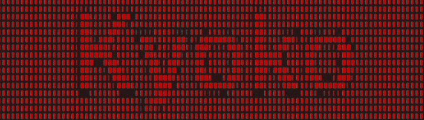

# Kyoko

[](https://github.com/kayba-ai/kyoko)
[![Kayba Website](https://img.shields.io/badge/kayba.ai-6B8BA8?style=flat&logo=data:image/png;base64,iVBORw0KGgoAAAANSUhEUgAAACAAAAAgCAYAAABzenr0AAAIpElEQVR42q1XbWwU1xU9d2Z29sPe2V3jyHVwDNixkiBiqKKixA1IBloKCRJSAaU4ip0PhaiJE0JSqSU/WqlpihpXiaJGmJBGSiGOEj4MjsuHhDApENzEjYHaxTbGJUUuBsvaHXt3vbuzM6c/1l6MvW7+5EpPu/t23rvnnvfm3HsFgArAzsvLu1/TtF+SrAYQBKDguzUHgCkipyyRHfFI5AIAVQDA7/evE5E9IhIgp64hAJmxkwggItmRWUOQhENmliHXPpx4nmMiUmuaZrPk5+cvVBSlQ0S8JNMZRkRy7AIRgaqqsG0HyWQCqVQKjuMAABRFhdutw+32QASwbWcagOwXW0Q0kilFUX6giai/FsGkc23agqypqoZ02oJpmvB6vZi/YAHmlZaisLAQiqJgeHgYl/v7MTAwADoODMOAoigTAGVyTwGgkUyLiO44zm/EMIxhEZlDZh+YGvOEcxWmGUEwGMRjjz2GjRs2YunSpfDl+QAAdtrG+Pg4TNPEpUuX0PTxxzh48ADGx8fh9XpBTg9IKAI4pCmGYSQAceekHAJFVRCJRLB27Vq8/tvXseT7SwAAHR0dOHz4MDo6OnD9+nVYloX8vHyUlZdhcWUlUpaF5uZm9Pf3Q1XV20BM3AMASMMwjIRhGMw1CgoKCIAvvPACU8kkSXJgYIBPPPEEjUCAE7zmHHPvnMuqqioWFRXR7/czEAjk8mHlYCBzXpqmIRwOY9OmTfho70eZqP/RgdraWvT29kJEcN999+Ghhx7C3eV3w+P1IBwOo7u7G+3t7RgcHITH44HH44HjOFOjnmqTDExFF2AwGKTP5+OCBQt47T/XmE6n2dXVxbvuuosAWFRUxIaGBl7/73VONytlsedSD7dt20afz8f8/HwGg0HOwrKV8wgmqX/zD2+SJGPRGNesWUMALCkpYVtbW8ZZ0mLn151sOdzC5uZmfvXlV4xFY1kwB/YfoGEY/w/ETACBQID5+fksKvoeey71kCT/2tpKXdfpdru55y97SJKdX3dy3bp1LCwspNvtpsfjYUFBAVetXMVjx44xmcjcmU8++YS6rjMQCOS6BzMBhEIhqqrKVatWMRaN0bEdPv/z5wmA1dXVTCaT7LnUw7KysuyF03WdiqJQRKhpGl0uF3fu3EkrZZEkt2/fTgAsKCiYAUDJpXa2baOsrAxerxfxeBy9vb0AgJUrV0LXdTT8sQEDAwNYvXo1PvjgA5xqO4VDzYewefNmuN1ueDwe1NfX48jRIwCBl7e+jIULFyIej0NRbnc5A8DkTfX7/RBFkEgmYI6aAICysjKMjY7h+PHjCAaD8Pv9OHToEHa9twv33HMP9u7di3f/9C5EFOi6jtdeew1DQ0MovKMQGzdsRCKR+BYAItB1HQBgmqMgCU3VsnNpK40rV67gxtANkMT+/fvR0tKCDz/8EFU/rMKXf/8StXW12PLss4jH4+jq6kJ7ezsIoqqqCrquZ1/JaQAyE4oIysvLoaoqLvf1IRaNId+fj/KycgDAyZMnYaUtpO00HMfBli1b8NRTTyMUCmFkZASNjY2wbRt1dXV46623cPGfF7Fi5Qok4gnMmz8PwWAQ6XQ6NwMiAsuyUFFRgVAohPMXzqPvch9UVcVP1qyBoggOHDyIM2fOYHHlYgQCATQ2NuLP77+PQCCQAd1/GclEEqXzSrF582ZcvHARra2tUDUNXo8XPq8vmz1nAFBVBfF4HEVFRaioqIBpmmhqagIAPPLIWvxo1Y8xNjaKhoYGpFIpjIyMYPuvtuPVX7yKSCQCkiicUwiPx4NIOILly5bh8ccfR9vJNui6C8lkElbauo1+AMgqYSiUEZ8n657kG797I/vanD1zliTZ19vHBx54gACy77yqqnS5XPR6vdQ0jUePHKVlWezu6mZxcTEB8J133iFJfvHFOfr9fhq360FGBwJGZtLn87G0tJSdX3eyoqKCIsJFixbx6r+vkiSvXbvG+vp6FhcXU9O07CiZO5d79+xlOp1mdCzK8fFxfvPNN3zmmWfYfq6dJLl79+4pWjAdwASqSQne1biLx48dnxAZN5csWcLzneezEtvb08sD+/fzvV3vsampiVf6rzCVSDEei7OpqYnLli1jS0sLk8kkw+Ew01aa69evp6IoDIVCMwFkJiaSUF4eS0pKaEZM7vj9DgKg2+1mcXEx3377bd68cZO5LBaNcWRkhPfee282ZwxcGaBt2zz9t9P0+Xy55PgWA4ZxiwUR4aZNm0iSO3bsoMfjoaIoVFWVlfdX8qWXXmLjzkZevXqVfX193Lp1Kx999FFGo1Hu3r2bJXNL2H6unalkhpXq6mpqmjYRvTEbAzOz4SvbXiFJtp1s44MPPkiXy3Vb0XH69GmeOHEi+/u5555jMplkV1cXU4kU6ZAv1r84Wx6YPR0bgQBDoRABsK62jqlkiiS579N9rKmp4eLFi+n3+/n5qc957tw5lpeXs6amhvs+3cdwOELHdhiPxTPORaaf+1QWcgEITMmMGSYqKyv5Wctn2fMeGxtjd3c3BwcHOTw8zBtDN7L/2WmbZ8+e5YoVKwhgFuczSjK4Z2tnNE1DNBqF4zhYvnw5Nvx0Ax5++GHMnz8fLpcLJGFZFgYHB3HhwgUcOnwYra2tSCTGEQgEZkjv9JJMDMMYBmTOlLp9Sh2f+VQUFQAxNjYG27YRDIZw553FKCgogCIKRsdGMXR9CDeHb8JxCMMwoKoKbNuezTEBAemMimEY+0Rkw63GRHI2JoBAVRVABGkrDctKZaNTFBW67oLL5co0gY6TqwCdaraIqCRbJC8vb5Gqqh0i4r7Vmk1nYmbRckvTJdsXfovTyZbLmXBuichSJRaLdYnIz0hGRUTL9IXIycAkLpKgQziOA8exp0Q8y9Jb8zLhPCYiNaZpnlcBqMlk8l8ej+cYyTkA7gCgT6L9DocNIAzgqIg8bZrmCQDq/wBcV6BSGdN3ewAAAABJRU5ErkJggg==&logoColor=white)](https://kayba.ai)
[](https://discord.gg/mqCqH7sTyK)
[](https://twitter.com/kaybaai)
[](https://www.python.org/downloads/)
[](LICENSE)

**Kyoko is a fully local system for debugging and improving agents with measured,
gated fixes.**

Kyoko captures what your agent actually did, finds recurring failures, turns
them into evidence-backed issues, drafts fixes, and tests them by rerunning the
failing trace, running deterministic checks, and comparing eval results before
applying them.

It is built for the way developers already debug agents: inspect the run,
understand the failure, decide what to fix, test the change, then ship it. You
can review every step manually, or automate the parts that pass the gate.

Everything stays local by default: traces, issues, proposals, evals, database,
and dashboard. For analysis and fix drafting, Kyoko can use the coding-agent CLI
you already have, like Codex or Claude Code, so there is no separate Kyoko model
API key or hosted service.


## Why Kyoko

- **Finds the failures that repeat across runs.** Kyoko looks across runs, groups recurring problems into evidence-backed issues, and shows where each one happened.
- **Turns issues into fixes.** Accepted issues become proposed changes to your agent context, skills, or harness.
- **Measures whether fixes worked.** Kyoko reruns failing traces, runs deterministic checks, and compares eval results before applying a fix.
- **Keeps the developer in control.** Review every issue, proposal, and apply decision manually, or automate only the parts that pass the gate.
- **Uses the tools you already have.** Codex, Claude Code, OpenClaw, Hermes, or a generic command can analyze evidence and draft fixes through existing CLI auth.
- **Runs locally by default.** SQLite, loopback dashboard, local traces, local proposals, and explicit external calls.
- **Connects to real agent stacks.** OTLP/GenAI, Python and TypeScript SDKs, importers, JSON CLI, dashboard, and MCP.

## The loop

```text
        ┌─────────────────┐           ┌─────────────────┐
        │  1. Analyse     │ ───────▶ │  2. Issues      │
        │  traces in      │           │  recurring      │
        │                 │           │  failures       │
        └─────────────────┘           └─────────────────┘
                 ▲                            │
                 │ measure                    │ accept
                 │                            ▼
        ┌─────────────────┐  ┌──────┐ ┌─────────────────┐
        │  4. Evals       │◀─┤ gate ├─│  3. Proposals   │
        │  failure rate   │  └──────┘ │  fixes          │
        │                 │   apply   │                 │
        └─────────────────┘           └─────────────────┘
```

Kyoko keeps the repair loop explicit. Every step creates something you can
inspect in the dashboard or CLI.

1. **Analyse:** Kyoko reads real traces from your agent and looks across runs
   for repeated behavior: tool mistakes, missing context, policy drift, brittle
   routing, bad handoffs, or eval failures.
2. **Issues:** recurring failures become evidence-backed issues with category,
   severity, occurrence count, and links to the spans where they happened.
3. **Proposals:** accepted issues become concrete fixes to your agent context,
   skills, evals, or harness. The fix stays reviewable before it can apply.
4. **Evals:** Kyoko reruns failing traces, runs deterministic checks, and
   compares eval results so the gate can decide whether the fix worked.

The **gate** is the control point. It applies a fix only when checks, replay
evidence, autonomy policy, and human locks allow it.

**Run it your way.** The same loop, the same gate. You pick the autonomy level:

- **Human-in-the-loop:** Kyoko surfaces issues and drafts fixes, and you review
  and approve each change before it applies.
- **Fully autonomous:** the policy auto-applies any change that clears replay,
  evals, and human locks, and parks anything that doesn't for you to look at.


## Quick demo

Try Kyoko without wiring up an agent. The demo creates a local database, loads
bundled fixture runs, and serves the dashboard.

```bash
pipx install kyoko
kyoko demo --db /tmp/kyoko-demo.db --json
kyoko serve --db /tmp/kyoko-demo.db
```

Open [http://127.0.0.1:8765](http://127.0.0.1:8765).

Requires Python 3.12 or newer. No live model, framework adapter, or replay
server is needed for the demo.

## Get started

Three steps: install Kyoko, wire up telemetry, open the dashboard.

**1. Install** (needs Python 3.12+):

```bash
pipx install kyoko
```

`pip install kyoko` and `uv tool install kyoko` work too. See
[docs/INSTALL.md](docs/INSTALL.md) for source installs, upgrades, and fixes.

Then, from the root of your agent project:

```bash
kyoko project-bootstrap
```

This writes a local `.kyoko/` workspace: database, scaffolds, MCP config, and
operator presets.

**2. Wire up telemetry.** This is the step that makes everything else work:
Kyoko can only find and fix what it can see, so nothing happens until your
agent's runs land in it. The easiest way is to let your coding agent do the
wiring:

```bash
kyoko install-skill   # then run /kyoko-instrument in your coding agent
```

This installs the bundled `/kyoko-instrument` skill into
`.claude/skills/`, where Claude Code picks it up automatically; for Codex,
Cursor, or other agents, `kyoko install-skill --print` prints the same playbook
to paste in. The skill finds your agent's entry point, records one real run,
and verifies it shows up in Kyoko. To wire telemetry by hand instead (Python or
TypeScript SDK, OTLP, importers), see
[Getting Started](docs/GETTING_STARTED.md).

**3. Open the dashboard:**

```bash
kyoko serve --db .kyoko/kyoko.db
```

Open [http://127.0.0.1:8765](http://127.0.0.1:8765) to see your runs, issues,
and proposals.

## What you get

- **Run capture:** Python SDK, TypeScript SDK, generated source adapters,
  OTLP/GenAI JSON, Hermes import, and OpenClaw import.
- **Issue queue:** recurring failures grouped into evidence-backed issues with
  category, severity, occurrence count, and span links.
- **Fix proposals:** accepted issues become validated `LearningProposal`
  records for context, skills, evals, or harness changes.
- **Verification:** bounded replay, deterministic checks, and eval comparison
  before a fix can apply.
- **Operator path:** Codex, Claude, OpenClaw, Hermes, or a generic command can
  analyze evidence and draft fixes through existing CLI auth.
- **Control surfaces:** local dashboard, JSON-everywhere CLI, and stdio MCP
  server, all sharing the same gated apply path.

| Area | Supported paths |
| --- | --- |
| Source telemetry | Python SDK, TypeScript SDK, generated source adapters, OTLP/GenAI JSON, Hermes import, OpenClaw import |
| Replay | External replay commands, managed HTTP replay servers, generated replay scaffolds |
| Operator agents | Codex, Claude Code, OpenClaw, Hermes, generic command adapters, local presets |
| Agent clients | Dashboard, JSON CLI, stdio MCP server |
| Framework scaffolds | Generic Python/TypeScript, LangGraph, Pydantic AI, OpenAI Agents, CrewAI, Hermes, OpenClaw, AI SDK |

See [docs/INTEGRATIONS.md](docs/INTEGRATIONS.md) and
[examples/README.md](examples/README.md).

## The gate and local boundary

Every behavior-changing path (operator output, imports, MCP tools, and
`kyoko improve`) flows through one gate:

1. Validate the structured proposal.
2. Resolve the evidence it references.
3. Generate or select checks.
4. Run bounded replay and deterministic checks.
5. Evaluate the autonomy policy.
6. Enforce human locks on protected targets.
7. Apply context or harness changes **only** if the gate allows it.

Operator agents can analyze evidence and draft fixes; they do not directly
mutate Kyoko state. Context writes update Kyoko-managed skills and delivery
rules. Harness writes create reviewable patch transactions against an explicit
workspace root.

Replay server URLs are loopback-only unless you pass `--allow-remote-server`.
Evidence exported to prompts, MCP, API, or bundles is redacted by default. See
[docs/SECURITY.md](docs/SECURITY.md) and [docs/ARCHITECTURE.md](docs/ARCHITECTURE.md).

## Documentation

- [Getting Started](docs/GETTING_STARTED.md): demo, project bootstrap,
  telemetry, inspection, and the repair loop.
- [Install](docs/INSTALL.md): install paths, verification, data location, and
  common setup fixes.
- [Integrations](docs/INTEGRATIONS.md): source adapters, replay adapters,
  operator agents, MCP, and SDKs.
- [CLI Reference](docs/CLI.md): grouped command reference.
- [Architecture](docs/ARCHITECTURE.md): runtime model, data model, and the gate.
- [Security](docs/SECURITY.md): local data, loopback serving, tokens,
  redaction, and write boundaries.
- [Scope](docs/SCOPE.md): what v0 is and is not.
- [Development](docs/DEVELOPMENT.md): tests, dashboard bundle, release smoke,
  and contract artifacts.

Specs, schemas, fixtures, and design decisions live under `docs/` as reference
contracts.

## Contributing

Issues and pull requests are welcome. See [CONTRIBUTING.md](CONTRIBUTING.md) for
local setup, the test and validation gates, and how to submit a change. To
report a security vulnerability, follow [SECURITY.md](SECURITY.md) rather than
opening a public issue.

## Repository layout

```text
kyoko/              Python import package, CLI runtime, dashboard/API, bundled assets
frontend/           React/Vite dashboard source
sdk/typescript/     Dependency-free TypeScript telemetry SDK
examples/           Source and replay hook examples
scripts/            Installer, release smoke, fixture and artifact helpers
tests/              Python unittest suite and CLI contract tests
docs/               User docs plus specs, schemas, fixtures, and decisions
```

## License

Apache-2.0. See [LICENSE](LICENSE).

---

<div align="center">

**Built by [Kayba](https://kayba.ai) and the open-source community.**

</div>
