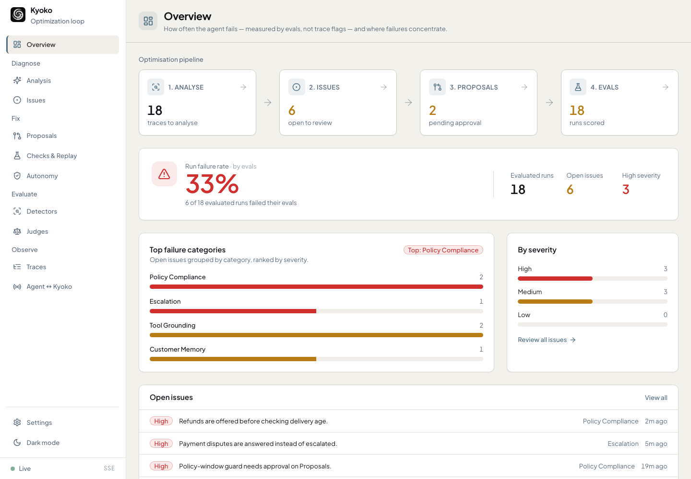
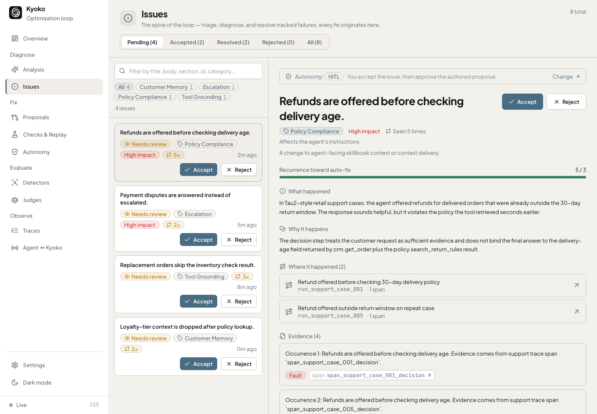

# Kyoko

[](https://github.com/kayba-ai/kyoko)
[![Kayba Website](https://img.shields.io/badge/kayba.ai-6B8BA8?style=flat&logo=data:image/png;base64,iVBORw0KGgoAAAANSUhEUgAAACAAAAAgCAYAAABzenr0AAAIpElEQVR42q1XbWwU1xU9d2Z29sPe2V3jyHVwDNixkiBiqKKixA1IBloKCRJSAaU4ip0PhaiJE0JSqSU/WqlpihpXiaJGmJBGSiGOEj4MjsuHhDApENzEjYHaxTbGJUUuBsvaHXt3vbuzM6c/1l6MvW7+5EpPu/t23rvnnvfm3HsFgArAzsvLu1/TtF+SrAYQBKDguzUHgCkipyyRHfFI5AIAVQDA7/evE5E9IhIgp64hAJmxkwggItmRWUOQhENmliHXPpx4nmMiUmuaZrPk5+cvVBSlQ0S8JNMZRkRy7AIRgaqqsG0HyWQCqVQKjuMAABRFhdutw+32QASwbWcagOwXW0Q0kilFUX6giai/FsGkc23agqypqoZ02oJpmvB6vZi/YAHmlZaisLAQiqJgeHgYl/v7MTAwADoODMOAoigTAGVyTwGgkUyLiO44zm/EMIxhEZlDZh+YGvOEcxWmGUEwGMRjjz2GjRs2YunSpfDl+QAAdtrG+Pg4TNPEpUuX0PTxxzh48ADGx8fh9XpBTg9IKAI4pCmGYSQAceekHAJFVRCJRLB27Vq8/tvXseT7SwAAHR0dOHz4MDo6OnD9+nVYloX8vHyUlZdhcWUlUpaF5uZm9Pf3Q1XV20BM3AMASMMwjIRhGMw1CgoKCIAvvPACU8kkSXJgYIBPPPEEjUCAE7zmHHPvnMuqqioWFRXR7/czEAjk8mHlYCBzXpqmIRwOY9OmTfho70eZqP/RgdraWvT29kJEcN999+Ghhx7C3eV3w+P1IBwOo7u7G+3t7RgcHITH44HH44HjOFOjnmqTDExFF2AwGKTP5+OCBQt47T/XmE6n2dXVxbvuuosAWFRUxIaGBl7/73VONytlsedSD7dt20afz8f8/HwGg0HOwrKV8wgmqX/zD2+SJGPRGNesWUMALCkpYVtbW8ZZ0mLn151sOdzC5uZmfvXlV4xFY1kwB/YfoGEY/w/ETACBQID5+fksKvoeey71kCT/2tpKXdfpdru55y97SJKdX3dy3bp1LCwspNvtpsfjYUFBAVetXMVjx44xmcjcmU8++YS6rjMQCOS6BzMBhEIhqqrKVatWMRaN0bEdPv/z5wmA1dXVTCaT7LnUw7KysuyF03WdiqJQRKhpGl0uF3fu3EkrZZEkt2/fTgAsKCiYAUDJpXa2baOsrAxerxfxeBy9vb0AgJUrV0LXdTT8sQEDAwNYvXo1PvjgA5xqO4VDzYewefNmuN1ueDwe1NfX48jRIwCBl7e+jIULFyIej0NRbnc5A8DkTfX7/RBFkEgmYI6aAICysjKMjY7h+PHjCAaD8Pv9OHToEHa9twv33HMP9u7di3f/9C5EFOi6jtdeew1DQ0MovKMQGzdsRCKR+BYAItB1HQBgmqMgCU3VsnNpK40rV67gxtANkMT+/fvR0tKCDz/8EFU/rMKXf/8StXW12PLss4jH4+jq6kJ7ezsIoqqqCrquZ1/JaQAyE4oIysvLoaoqLvf1IRaNId+fj/KycgDAyZMnYaUtpO00HMfBli1b8NRTTyMUCmFkZASNjY2wbRt1dXV46623cPGfF7Fi5Qok4gnMmz8PwWAQ6XQ6NwMiAsuyUFFRgVAohPMXzqPvch9UVcVP1qyBoggOHDyIM2fOYHHlYgQCATQ2NuLP77+PQCCQAd1/GclEEqXzSrF582ZcvHARra2tUDUNXo8XPq8vmz1nAFBVBfF4HEVFRaioqIBpmmhqagIAPPLIWvxo1Y8xNjaKhoYGpFIpjIyMYPuvtuPVX7yKSCQCkiicUwiPx4NIOILly5bh8ccfR9vJNui6C8lkElbauo1+AMgqYSiUEZ8n657kG797I/vanD1zliTZ19vHBx54gACy77yqqnS5XPR6vdQ0jUePHKVlWezu6mZxcTEB8J133iFJfvHFOfr9fhq360FGBwJGZtLn87G0tJSdX3eyoqKCIsJFixbx6r+vkiSvXbvG+vp6FhcXU9O07CiZO5d79+xlOp1mdCzK8fFxfvPNN3zmmWfYfq6dJLl79+4pWjAdwASqSQne1biLx48dnxAZN5csWcLzneezEtvb08sD+/fzvV3vsampiVf6rzCVSDEei7OpqYnLli1jS0sLk8kkw+Ew01aa69evp6IoDIVCMwFkJiaSUF4eS0pKaEZM7vj9DgKg2+1mcXEx3377bd68cZO5LBaNcWRkhPfee282ZwxcGaBt2zz9t9P0+Xy55PgWA4ZxiwUR4aZNm0iSO3bsoMfjoaIoVFWVlfdX8qWXXmLjzkZevXqVfX193Lp1Kx999FFGo1Hu3r2bJXNL2H6unalkhpXq6mpqmjYRvTEbAzOz4SvbXiFJtp1s44MPPkiXy3Vb0XH69GmeOHEi+/u5555jMplkV1cXU4kU6ZAv1r84Wx6YPR0bgQBDoRABsK62jqlkiiS579N9rKmp4eLFi+n3+/n5qc957tw5lpeXs6amhvs+3cdwOELHdhiPxTPORaaf+1QWcgEITMmMGSYqKyv5Wctn2fMeGxtjd3c3BwcHOTw8zBtDN7L/2WmbZ8+e5YoVKwhgFuczSjK4Z2tnNE1DNBqF4zhYvnw5Nvx0Ax5++GHMnz8fLpcLJGFZFgYHB3HhwgUcOnwYra2tSCTGEQgEZkjv9JJMDMMYBmTOlLp9Sh2f+VQUFQAxNjYG27YRDIZw553FKCgogCIKRsdGMXR9CDeHb8JxCMMwoKoKbNuezTEBAemMimEY+0Rkw63GRHI2JoBAVRVABGkrDctKZaNTFBW67oLL5co0gY6TqwCdaraIqCRbJC8vb5Gqqh0i4r7Vmk1nYmbRckvTJdsXfovTyZbLmXBuichSJRaLdYnIz0hGRUTL9IXIycAkLpKgQziOA8exp0Q8y9Jb8zLhPCYiNaZpnlcBqMlk8l8ej+cYyTkA7gCgT6L9DocNIAzgqIg8bZrmCQDq/wBcV6BSGdN3ewAAAABJRU5ErkJggg==&logoColor=white)](https://kayba.ai)
[](https://discord.gg/mqCqH7sTyK)
[](https://twitter.com/kaybaai)
[](https://www.python.org/downloads/)
[](LICENSE)

**Kyoko is the all-in-one, fully local tool for debugging and improving your AI
agents.**

Point it at **any agent you're building** — instrument it with OpenTelemetry or
the SDKs — or plug straight into CLI agents you already run like Codex, Claude
Code, OpenClaw, and Hermes. Kyoko captures what your agent actually does and
runs a closed repair loop over it: it **analyses** real runs into a living state
reflection of the system, files recurring and generalised failures as
**issues**, drafts concrete **fixes**, and proves them with replay and **evals**
before anything ships. Everything runs on your machine — traces, database, and
dashboard — and any model or external call is opt-in.

Most agent tooling stops at showing you traces; you still have to read them,
guess what went wrong, write the fix, and hope it didn't break something else.
Kyoko closes that gap end to end, in one place.

That state reflection is cumulative: Kyoko keeps learning from traces, issues,
fixes, replays, and evals, so it can surface the problems humans would not
think to measure by hand while still respecting the detectors and judges you
explicitly choose.



## Why Kyoko

- **OpenTelemetry-native.** Ingests OTLP/GenAI spans; SDKs and importers for the rest.
- **Runs on your coding agent.** Codex, Claude Code, OpenClaw, Hermes do the analysis *and* author fixes — through their own CLI login, so no API keys and no extra spend.
- **Fully local.** SQLite + loopback UI. Nothing leaves your machine; external calls opt-in.
- **Cumulative analysis.** Builds a state reflection from traces, issues, evals, and fixes, so repeated behavior becomes more accurate fixes over time.
- **Measured, not guessed.** Failure rate from real evals — not status flags.
- **Safe by default.** No change ships without passing the gate. No shortcuts, anywhere.
- **Zero-fuss.** One `kyoko` CLI, near-zero deps, `--json` everywhere. No server, no cloud.

## The loop

```text
        ┌─────────────────┐           ┌─────────────────┐
        │  1. Analyse     │ ─────-──▶ │  2. Issues      │
        │  traces in      │           │  recurring      │
        │                 │           │  failures       │
        └─────────────────┘           └─────────────────┘
                 ▲                            │
                 │ measure                    │ accept
                 │                            ▼
        ┌─────────────────┐  ┌──────┐ ┌─────────────────┐
        │  4. Evals       │◀-┤ gate ├─│  3. Proposals   │
        │  failure rate   │  └──────┘ │  candidate      │
        │                 │   apply   │  fixes          │
        └─────────────────┘           └─────────────────┘

   Gate = checks · replay · policy · locks; a fix applies only if it passes.
   Evals score the result and feed the next analysis — the loop tightens.
```

1. **Analyse** — Kyoko reads your agent's traces *for you*, diagnoses what went
   wrong, and updates a state reflection of how the system behaves over time.
   No manual log-digging.
2. **Issues** — it surfaces the failures to you automatically as first-class,
   evidence-backed issues, grouped by category and severity so you fix the
   pattern, not the symptom — including problems you did not predefine as a
   metric.
3. **Proposals** — each accepted issue becomes a concrete fix (to context/skills
   or the agent's harness), then runs the **gate**: generated checks, bounded
   replay, autonomy policy, and human locks. It applies only if it passes.
4. **Evals** — a measurement plane of deterministic detectors and LLM judges
   scores runs into a failure rate, before vs after. Failure is decided by
   evals, never by a status flag on a trace.

**Run it your way.** The same loop, the same gate — you pick the autonomy level:

- **Human-in-the-loop** — Kyoko surfaces issues and drafts fixes, and you review
  and approve each change before it applies.
- **Fully autonomous** — the policy auto-applies any change that clears replay,
  evals, and human locks, and parks anything that doesn't for you to look at.

Either way, nothing behavior-changing ships without passing the gate.



## Quick demo

Kyoko requires Python 3.12 or newer. From this checkout:

```bash
python3 -m pip install .
kyoko demo --db /tmp/kyoko-demo.db --json
kyoko serve --db /tmp/kyoko-demo.db
```

Open [http://127.0.0.1:8765](http://127.0.0.1:8765).

The demo runs the full loop against bundled fixture data, so it needs no live
model, framework adapter, or replay server.

## Install

```bash
git clone https://github.com/kayba-ai/kyoko.git
cd kyoko
python3 -m pip install .
```

After the package is published, prefer an isolated CLI install:

```bash
pipx install kyoko
```

See [docs/INSTALL.md](docs/INSTALL.md) for `uv`, editable installs, the
installer script, upgrades, and common setup fixes.

## Use it in your project

Run this from the root of an agent project:

```bash
kyoko project-bootstrap \
  --project-dir . \
  --profile-name my-agent \
  --source-framework generic-python \
  --replay-framework generic-python \
  --mcp-target codex
```

`project-bootstrap` writes `.kyoko/kyoko.db`, source/replay scaffolds, MCP
config, operator presets, and `.kyoko/NEXT_STEPS.md`. Then check readiness and
start the dashboard:

```bash
kyoko doctor --db .kyoko/kyoko.db --safe-smokes --json
kyoko serve --db .kyoko/kyoko.db
```

Point telemetry at Kyoko with the Python or TypeScript SDK, a generated
adapter, or an importer — see [Getting Started](docs/GETTING_STARTED.md) for the
end-to-end walkthrough.

## What you get

- **Telemetry in:** Python SDK, TypeScript SDK, generated source adapters,
  OTLP/GenAI JSON, Hermes import, OpenClaw import.
- **Diagnosis:** per-trace and cumulative analysis that folds behavior into a
  state reflection, then turns recurring or generalised weaknesses into
  evidence-backed issues with category, severity, and the spans where they
  happened.
- **Fixes out:** issues become validated `LearningProposal` records — authored
  by you or an operator agent (Codex, Claude, or a generic command).
- **Verification:** generated checks plus bounded replay against external
  commands or managed loopback replay servers.
- **Measurement:** an evidence-only eval plane — deterministic detectors and
  LLM-judge evals — for what you choose to measure, alongside analysis that
  surfaces unmeasured patterns from observed behavior.
- **Surfaces:** a local dashboard, a JSON-everywhere CLI, and a stdio MCP server
  for coding agents — all sharing the same gated apply path.

| Area | Supported paths |
| --- | --- |
| Source telemetry | Python SDK, TypeScript SDK, generated source adapters, OTLP/GenAI JSON, Hermes import, OpenClaw import |
| Replay | External replay commands, managed HTTP replay servers, generated replay scaffolds |
| Operator agents | Codex, Claude, generic command adapters, local presets |
| Agent clients | Dashboard, JSON CLI, stdio MCP server |
| Framework scaffolds | Generic Python/TypeScript, LangGraph, Pydantic AI, OpenAI Agents, CrewAI, Hermes, OpenClaw, AI SDK |

See [docs/INTEGRATIONS.md](docs/INTEGRATIONS.md) and
[examples/README.md](examples/README.md).

## How safety works

Every behavior-changing path — operator output, imports, MCP tools, and
`kyoko improve` — flows through one gate:

1. Validate the proposal against its schema.
2. Resolve the evidence it references.
3. Generate or select checks.
4. Run bounded replay and the checks.
5. Evaluate the autonomy policy.
6. Enforce human locks on protected targets.
7. Apply context or harness changes **only** if the gate allows it.

Context writes update Kyoko-managed skills and delivery rules; harness writes
create reviewable patch transactions against an explicit workspace root.
Replay server URLs are loopback-only unless you pass `--allow-remote-server`,
and evidence exported to prompts, MCP, API, or bundles is redacted by default.
See [docs/SECURITY.md](docs/SECURITY.md) and [docs/ARCHITECTURE.md](docs/ARCHITECTURE.md).

## Documentation

- [Getting Started](docs/GETTING_STARTED.md): demo, project bootstrap,
  telemetry, inspection, and the repair loop.
- [Install](docs/INSTALL.md): install paths, verification, data location, and
  common setup fixes.
- [Integrations](docs/INTEGRATIONS.md): source adapters, replay adapters,
  operator agents, MCP, and SDKs.
- [CLI Reference](docs/CLI.md): grouped command reference.
- [Architecture](docs/ARCHITECTURE.md): runtime model, data model, and the gate.
- [Security](docs/SECURITY.md): local data, loopback serving, tokens,
  redaction, and write boundaries.
- [Scope](docs/SCOPE.md): what v0 is and is not.
- [Development](docs/DEVELOPMENT.md): tests, dashboard bundle, release smoke,
  and contract artifacts.

Specs, schemas, fixtures, and design decisions live under `docs/` as reference
contracts.

## Repository layout

```text
kyoko/              Python import package, CLI runtime, dashboard/API, bundled assets
frontend/           React/Vite dashboard source
sdk/typescript/     Dependency-free TypeScript telemetry SDK
examples/           Source and replay hook examples
scripts/            Installer, release smoke, fixture and artifact helpers
tests/              Python unittest suite and CLI contract tests
docs/               User docs plus specs, schemas, fixtures, and decisions
```

## License

Apache-2.0. See [LICENSE](LICENSE).

---

<div align="center">

**Built by [Kayba](https://kayba.ai) and the open-source community.**

</div>
